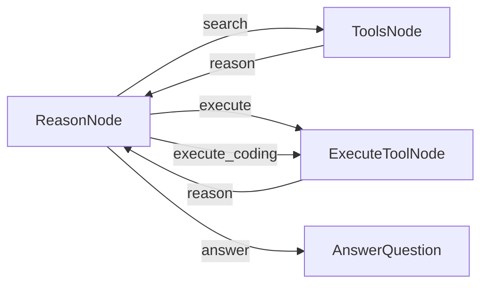

# PocketFlow Advanced Tool Calling Demo

This project shows how to build an agent that performs 2 advanced methods of tool calling (brought by Claude). 

1st is to encode tool metadata that could be search with embedding, instead of loading all tool info into context. **Progressively disclose** most matching tool info into context window, hence tool info could be more rich like adding best examples.

2nd is (quote) "**Programmatic Tool Calling (PTC)** enables Claude to orchestrate tools **through code** rather than **through individual API round-trips**. Instead of Claude requesting tools one at a time with each result being returned to its context, Claude writes code that calls multiple tools, processes their outputs, and controls what information actually enters its context window."

This implementation is based on : 

- the article: [Introducing advanced tool use on the Claude Developer Platform](https://www.anthropic.com/engineering/advanced-tool-use)

- the cookbook: [Programmatic Tool Calling (PTC)](https://github.com/anthropics/claude-cookbooks/blob/main/tool_use/programmatic_tool_calling_ptc.ipynb)

- the cookbook: [Tool Search With Embeddings](https://github.com/anthropics/claude-cookbooks/blob/main/tool_use/tool_search_with_embeddings.ipynb)

## Features

- Search relatively a big number of tools based on embedding
- Match with similairy score (easy to scale), progressively loading tool info into context
- Support both single tool calling based on PocketFlow
- Support multiple tool calling (by generated code using provided tools)

## How to Run

1. Set your API key:
   ```bash
   export OPENAI_API_KEY="your-api-key-here"
   ```
   Or update it directly in `utils.py`

2. Install and run:
   ```bash
   pip install -r requirements.txt
   python main.py
   ```

## An Easier Way for Multiple Tool Calling and Save Lots of Tokens

### Typical Tool Calling Flow

- User input a complex question (like a sequence of compound SQL statements) that needed rounds of tool calling (depending on how smart of the model either). 

- **Model Loaded all tool info into context**

- Model run the **1st call and get the 1st result** .

- Pass result into next round of prompt .

- Start the **2nd round , and then 3rd , 4th**....

- According Claude's article , this will cause 10x more token usage

### New Method

- User input a complex question that needed rounds of tool calling.

- Model search most-relevant tools and get tool name , params, input schema into context .

- Model knew the tool could be called with python scripting , so generate python code to run .

- Code finished running in sandbox and return results back to Model .

- Then Model will process all the results in next round .


## How It Works



    reason_node - "tool_search" >> tools_node
    tools_node - "reason" >> reason_node
    reason_node - "tool_execute" >> exec_node
    reason_node - "tool_execute_coding" >> exec_node
    exec_node - "reason" >> reason_node
    reason_node - "answer" >> answer_node

The agent uses PocketFlow to create a workflow where:
1. ReasonNode takes user input about Stock Tickers
2. ReasonNode choose what string to search with Tools (embeddings)
3. ToolsNode returned search results (similarity score, name, parameters)
4. ReasonNode choose to make single tool calling , or generate python code for multiple rounds of tool calling in one shot (which saved A LOT of tokens!)
5. AnswerNode craft final answers based on ReasonNode's context

## Files

- [`main.py`](./main.py): Implementation of nodes and flow assembling
- [`utils.py`](./utils.py): Helper functions tool calling and tool coding running (minimal unsafe way of using subprocess, only for demo purpose)
