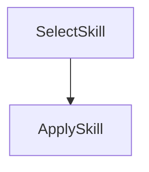

# Agent Skills with PocketFlow

This cookbook shows a lightweight pattern for using **Agent Skills** inside a PocketFlow graph.

Agent Skills are just reusable instruction files (Markdown) that you can route to at runtime.

## What this demo does

- keeps skills as local markdown files (`./skills/*.md`)
- chooses a skill based on the user request
- injects the chosen skill into the final LLM prompt

## Flow



1. **SelectSkill** picks a skill file (e.g. executive brief vs checklist writer)
2. **ApplySkill** reads that skill and executes the task with the LLM

## Run

```bash
pip install -r requirements.txt
export OPENAI_API_KEY="your-key"
python main.py --"Summarize this launch plan for a VP audience"
```

Try another task:

```bash
python main.py --"Turn this into an implementation checklist"
```

## Files

- `main.py` — CLI entry
- `flow.py` — graph wiring
- `nodes.py` — skill selection + execution nodes
- `utils.py` — load skills + LLM helper
- `skills/*.md` — reusable Agent Skills
