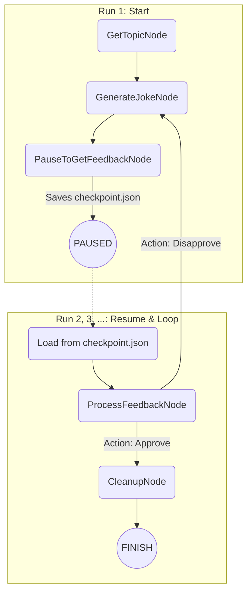

# PocketFlow CLI HITL Resume Example

This example is a refactored version of the original `pocketflow-cli-hitl` (the joke generator), but it uses the new **workflow resume** functionality to handle the Human-in-the-Loop (HITL) feedback cycle.

Instead of a single, long-running process with an internal loop, this version demonstrates how to **pause** the workflow after each joke, save its state, and **resume** it upon the next script execution to process user feedback. This pattern is more robust and closer to real-world applications where user interaction may not be immediate.

## Features

- **Resume-based HITL**: A feedback loop implemented by pausing and resuming the workflow.
- **Stateful Execution**: The conversation context (topic, disliked jokes) is persisted across multiple runs.
- **Decoupled Interaction**: Each step of the interaction (generation, feedback) is a separate execution of the script.

## Getting Started

1.  **Install dependencies**:
    ```bash
    pip install -r requirements.txt
    ```

2.  **Set up your OpenAI API key**. The OpenAI client will automatically pick it up from the `OPENAI_API_KEY` environment variable. You can set it by:
    ```bash
    export OPENAI_API_KEY="your-openai-api-key-here"
    ```

3.  **Run the application**:

    **Run 1: Start and get the first joke**
    ```bash
    python main.py
    ```
    The app will ask for a topic, generate a joke, and then pause, creating `joke_checkpoint.json`.

    **Run 2: Provide feedback and get another joke (or end)**
    ```bash
    python main.py
    ```
    The app detects the checkpoint, resumes the flow, asks for your feedback (`yes/no`), and then either:
    - **If "no"**: Generates a new joke and pauses again, waiting for your next run.
    - **If "yes"**: Finishes the process and cleans up the checkpoint file.

## How It Works

This workflow explicitly separates the generation and feedback steps into different runs.



1.  **Initial Run**: The flow executes `GetTopicNode` -> `GenerateJokeNode`. The `GenerateJokeNode` prints the joke.
2.  **Pause**: The flow then hits `PauseToGetFeedbackNode`. This node's only job is to save the current `shared` state and its own `node_id` into `joke_checkpoint.json` and then stop the flow.
3.  **Subsequent Runs**: When `main.py` is run again, it finds `joke_checkpoint.json`. It loads the state and calls `flow.resume()`.
4.  **Resume and Feedback**: The framework knows the flow paused at the `pause` node. It continues to the next connected node, `ProcessFeedbackNode`. This node asks the user for input ("yes/no").
5.  **Loop or End**:
    - If the user says "no", `ProcessFeedbackNode` returns a `"Disapprove"` action. The flow graph directs this action back to `GenerateJokeNode`, which creates a new joke and leads back to the `pause` node, starting the cycle again.
    - If the user says "yes", it returns an `"Approve"` action, which leads to `CleanupNode`. This node prints a final message and deletes the checkpoint file, ending the loop.

This implementation is more resilient than the original because the state is persisted to disk, meaning the "conversation" can survive system restarts or long delays between interactions. 